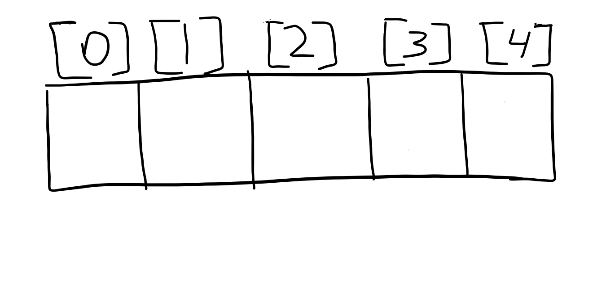

**Массив** - это простая структура данных. Массив хранит в себе данные какого - либо типа (целые, символы и т.д). Массив можно представить в виде шкафа с пронумерованными ячейками. Как правило, ячейки нумеруются с нуля. Но на практике это правило применяется не всегда.

В этих самых ячейках мы можем хранить значения.

## Массивы в C++
Объявляется массив следующим образом: <тип данных> <имя>[<размер>].

int arr[10];

Так мы объявили массив arr емкостью 10 элементов.

Также массивы можно проинициализировать самому.

int arr[] = { 5, 4, 8, 2, 1}; // в таком случае размер можно не указывать


Массивы могут быть не только одномерными, какие мы использовали до этого, но и двумерные (таблицы).

int arr[10]; // одномерный массив
int brr[10][10]; // двумерный массив


## Как обратиться к элементу массива?

Например, если мы хотим вывести 1 элемент массива (напомню, что индексы нумеруются с нуля), мы можем сделать так:

  cout << arr[1];


Если мы хотим вывести все элементы массива, то используем цикл:

int main()
{
	int arr[] = { 5, 4, 8, 2, 1 };
	for (int i = 0; i < 5; i++)
		cout << arr[i] << " ";
	return 0;
}


Также мы будем использовать цикл, чтобы ввести значения массива:

int main()
{
	int arr[10];
	for (int i = 0; i < 10; i++)
		cin >> arr[i];
	return 0;
}

Теперь в массиве arr хранятся 10 введенных нами значений.

## Решение тривиальных задач
1) Дано число N - количество чисел в последовательности и сама последовательность. Найти сумму элементов последовательности.

5
8 10 5 6 4 7


Создадим переменную sum, равную нулю. Далее считаем N и в цикле считаем элементы последовательности в массив. Будем прибавлять к сумме каждый новый элемент. Выведем сумму. Задача решена.

#include <iostream>

using namespace std;

int main()
{
	int arr[100], n, sum = 0;
	cin >> n;
	for (int i = 0; i < n; i++)
	{
		cin >> arr[i];
		sum += arr[i];
	}
	cout << sum;
	return 0;
}

2) Дано число N - количество чисел в последовательности и сама последовательность. Найти максимум в последовательности.
Создадим переменную max. Давайте подумаем, какое значение необходимо присвоить max? Чтобы найти максимум, мы изначально должны максимуму присвоить самое минимальное значение, которого у нас не может быть.

Для этого в языке C++ определены константы, они находятся в заголовочном файле <clinits>. В данной задаче мы будем использовать константу INT_MIN.
	
Введем наш массив. Далее пройдемся по нему циклом и каждый элемент будем сравнивать с переменной max. Если элемент массива больше max, то мы присваиваем max этот элемент.


#include <iostream>

using namespace std;

int main()
{
	int arr[100], n, max = INT_MIN;
	cin >> n;
	for (int i = 0; i < n; i++)
	{
		cin >> arr[i];
	}
	for (int i = 0; i < n; i++)
	{
		if (arr[i] > max)
			max = arr[i];
	}
	cout << max;
	return 0;
}

