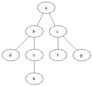

**Поиск в ширину** (англ. breadth-first search, BFS) - метод обхода и поиска пути в графе.
Когда мы говорим слово "обход" мы подразумеваем, что мы посещаем вершины графа в определенном порядке. Одним из часто используемых методов обхода графа является обход в ширину (BFS). Суть BFS достаточно проста. Обход начинается с посещения определённой вершины (для обхода всего графа часто выбирается произвольная вершина). Затем алгоритм посещает соседей этой вершины. За ними - соседей соседей, и так далее.

Ниже представлена визуализация алгоритма BFS. Серым помечены вершины в очереди на посещение, чёрным - уже посещённые.

## Реализация
Для реализации алгоритма нам потребуется очередь из вершин для посещения. При посещении очередной вершины в очередь добавляются все её соседи, которые ещё не были посещены и ещё не находятся в очереди. Для проверки, была ли вершина уже посещена, используется массив меток. Изначально $$visited[i] = false$$ для всех $$i$$, кроме начальной вершины. При добавлении вершины $$i$$ в очередь $$visited[i]$$ присваивается $$true$$.


#include <iostream>
#include <queue>

using namespace std;

bool used[1900];

vector <vector<int>> graph(100);

void bfs(int u)
{
	queue <int> q;
	q.push(u);
	used[u] = true;
	while (!q.empty())
	{
		int current = q.front();
		q.pop();
		cout << current << endl;
		for (auto neighbor : graph[current])
		{
			if (!used[neighbor])
			{
				q.push(neighbor);
				used[neighbor] = true;
			}
		}
	}
}
  
