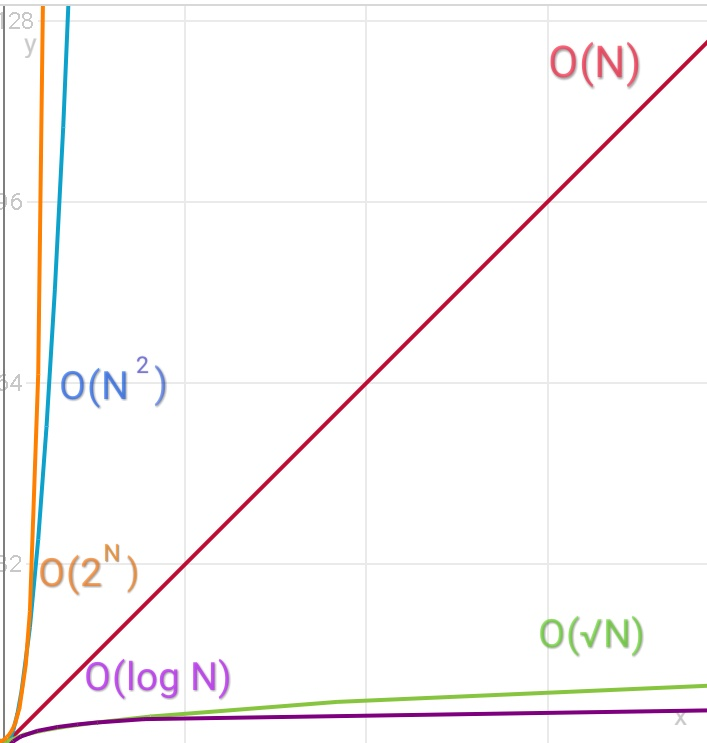

Решая задачи, вы наверняка не раз замечали, что решение, которое на первый взгляд кажется правильным, получает вердикт "Time limit exceeded". Это означает, что ваша программа превысила максимально допустимое время выполнения. Почему так происходит?

Мы можем характеризовать программу по двум параметрам - затраченному времени и затраченной памяти. Из этих двух параметров складывается *эффективность* нашего кода. В данной статье мы не будем рассматривать затраченную память как ключевой параметр, так как если решение не укладывается в ограничение по памяти, то скорее всего такое решение не уложится и в ограничение по времени.

На практике подсчитать точное время работы программы невозможно. Вместо этого в информатике используют зависимость времени работы от входных данных.
Допустим, мы хотим подсчитать сумму элементов в одномерном массиве. Пусть количество элементов равно **n**.


int a[100], sum = 0;
//заполняем массив
for(int i = 0;i<n;i++)
sum += a[i];
cout<< sum <<endl;


Сколько операций мы выполним, чтобы пройтись по массиву? Верный ответ - **n**. Теперь необходимо ввести понятие "О большое". Чтобы  не связываться со сложными математическими определениями скажем, что О большое - это функция, которая показывает нам, сколько операций потребуется для выполнения алгоритма. В данном примере сложность алгоритма - $$ O(n) $$, линейный рост. Это означает, что если мы увеличим количество входных данных в 2 раза, количество операций также возрастет в 2 раза.

Теперь нам нужно подсчитать сумму элементов двумерного массива, где количество строк и столбцов равно **n**:

int a[100][100], sum = 0;
//заполняем массив
for(int i = 0;i<n;i++)
{
 for(int j = 0;j<n;j++)
 sum += a[i][j];
}
cout<< sum <<endl;


Сколько операций мы выполним, чтобы пройтись по массиву? Для этого нужно количество проходов в первом цикле умножить на количество проходов во втором цикле, то есть $$ O(n×n) $$  или же $$ O(n^2) $$. Это квадратичный рост. Иными словами, при увеличении входных данных в 2 раза количество операций возрастет в 4 раза. Если же у нас количество строк равно m, а количество столбцов n, то сложность будет $$ O(m×n) $$.

Чтобы увеличить эффективность алгоритма, нужно заняться оптимизацией. Одним из примеров оптимизации является динамическое программирование, о нем мы поговорим в будущем.

Чаще всего для одной переменной встречаются следующие значения сложности:

- \$$O(1)$$

- \$$O(\sqrt N)$$

- \$$O(N)$$

- \$$O(N \log N)$$

- \$$O(N \sqrt N)$$

- \$$O(N^2)$$

- \$$O(2^N)$$

- \$$O(N!)$$

С точки зрения скорости, функции можно расположить следующим образом:

\$$O(1) << O(\log N) << O(N^A) << O(A^N) << O(N!) << O(N^N)$$, где A=const, т.е. заранее известное неизменное число, а знак << - левая быстрее правой

## Практическое применение
Дано число $$n$$, $$1 \le n \le 10^6 $$. Далее перечислены n целых положительных чисел. Вывести из этих чисел максимальное произведение.
Пример входных данных:

5
20 13 44 55 7

Пример выходных данных:

2420


Напишем "наивное" решение. Будем хранить все n чисел в массиве и поочередно проходить по ним.

int n, a[100], maxp = 1;
	cin >> n;
	for (int i = 0; i < n; i++)
	{
		cin >> a[i];
	}
	for (int i = 0; i < n; i++)
	{
		for (int j = i + 1; j < n; j++)
		{
			if (a[i] * a[j] > maxp)
				maxp = a[i] * a[j];
		}
	}
	cout << maxp;

Данное решение действительно выдает правильный ответ. Но всегда ли так будет?

Давайте проанализируем эту программу. В основе алгоритма положен простой принцип: мы берем первое число и по очереди перемножаем его со всеми соседними. Получается, что для первого элемента у нас будет $$n-1$$ соседей, для второго элемента $$n-2$$ соседей и так далее. В итоге если мы получаем арифметическую прогрессию. Сумма первых $$n$$ членов арифметической прогрессии определяется как:

$$S_n = \frac{2a_1 + d(n-1)}{2} * n$$

или же

$$S_n = \frac{(n + 1)n}{2}$$

Если мы рассматриваем асимптотику функции, мы можем не рассматривать действия с константами, так, мы можем избавиться от прибавления единицы и деления на 2 (так как это умножение на константу 1/2). Мы можем это сделать, так как при больших n эти константы не сыграют существенной роли.

В итоге мы имеем: $$ O(N^2) $$. Рассмотрим ограничения на n. Самое большое, что у нас может быть, это $$10^6$$. Получается, что максимальное число операций: $$10^{12}$$. Если принять, что в среднем процессор выполняет $$10^8$$ простых операций языка C++ в секунду, то весь наш процесс займет $$10^4$$ секунд. Это приблизительно 3 часа. Стоит ли говорить, что это неприемлимо много?

Поэтому нам требуется найти оптимальное решение - и динамическое программирование -  один из возможных выходов.
