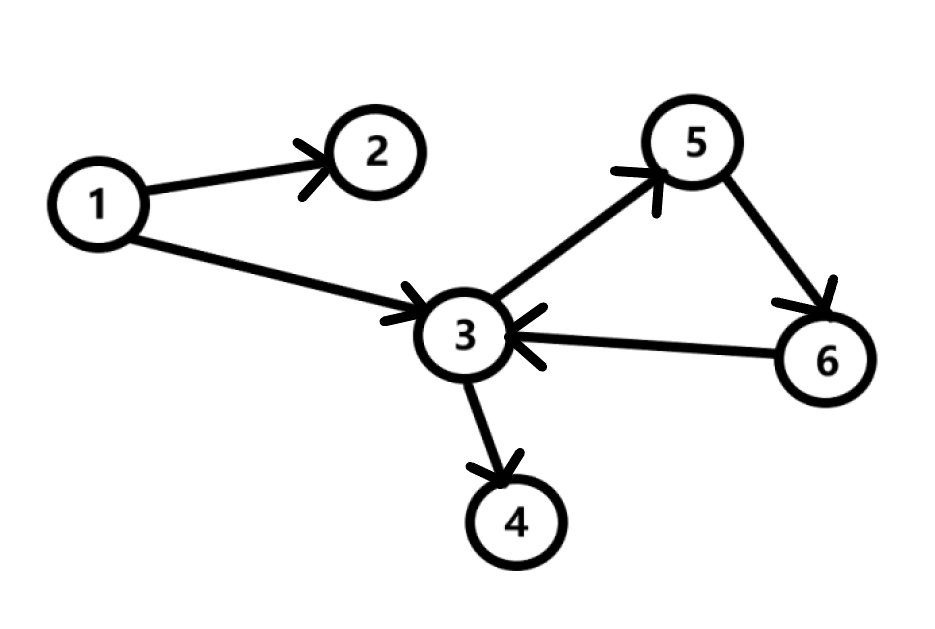
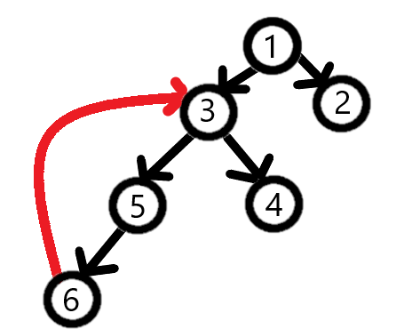

Рассмотрим следующий ориентированный граф:

Нам необходимо ответить на вопрос: "А содержит ли данный граф хоть один цикл?". Напомним, что **циклом** в теории графов называют путь, в котором начало и конец совпадают.

Стоит отметить, что нам в данном случае просто необходимо установить факт наличия цикла в графе. Найти эти самые циклы - задача более сложного порядка.

## Алгоритм
Для поиска будем использовать DFS. Рассмотрим дерево рекурсивных вызовов в нашем графе:

Как мы видим, существует восходящее (красное) ребро, по которому DFS не спускался. Данное ребро ведет в такого соседа, который не является прямым предком данной вершины. Это является признаком цикла в графе, и таким образом, мы можем организовать проверку на наличие цикла (циклов).


bool used[100];
vector <vector<int>> graph(100);

void dfs(int vertex, int parent = -1)// parent - предок текущей вершины
{
	used[vertex] = true;
	for (auto neighbor : graph[vertex])
	{
		if (!used[neighbor])
			dfs(neighbor,vertex);
		else if(neighbor != parent)
		{
			cout << "Grath has a cycle!";
			exit(0); // выйти из программы
		}
	}
}

int main()
{
	int n;
	cout << "Enter the number of edges: ";
	cin >> n;
	for (int i = 0; i < n; i++)
	{
		int a, b;
		cin >> a >> b;
		graph[a].push_back(b);
	}
	dfs(1); // начинаем обход с первой вершины
	cout << "graph has no cycles";// если мы принудительно не вышли из программы, значит в графе нет циклов
	return 0;
}

