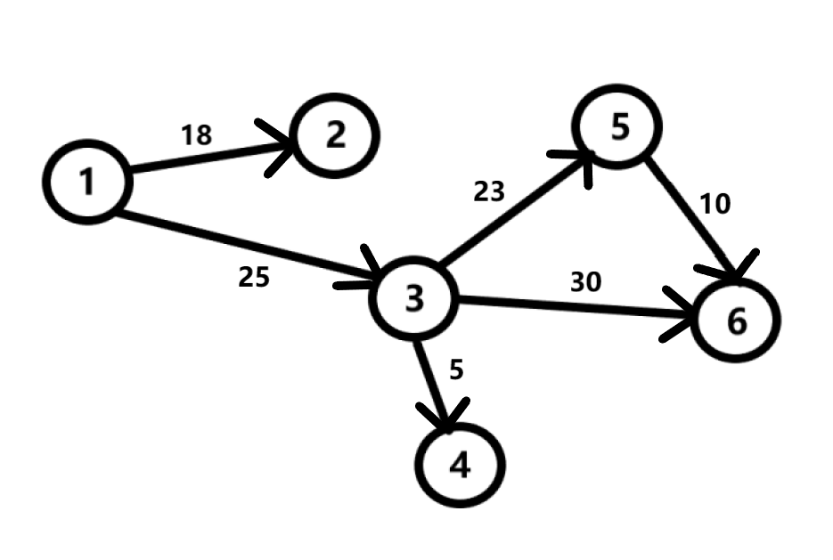
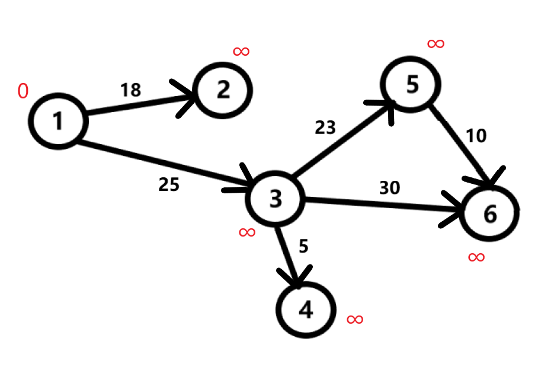
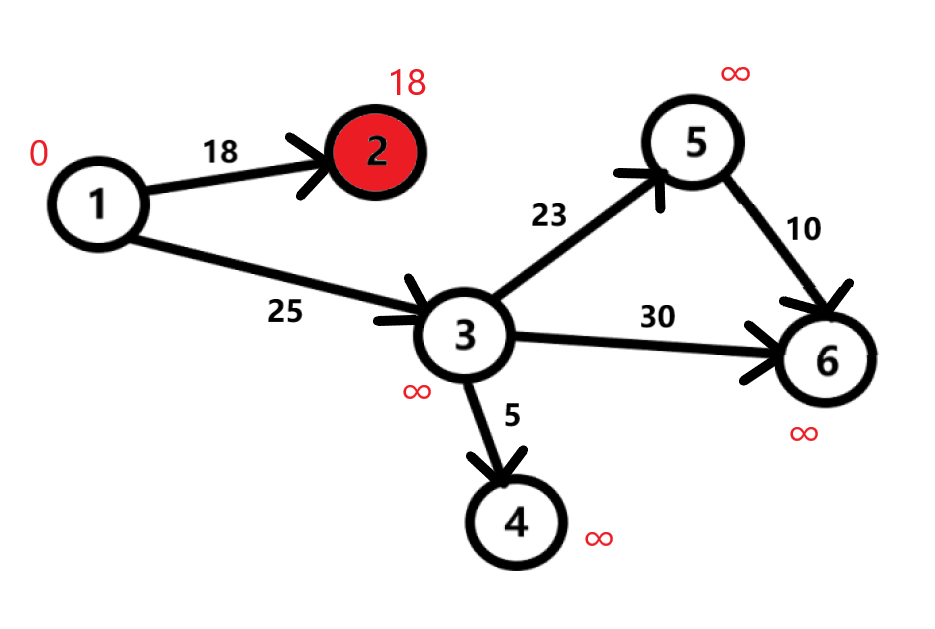
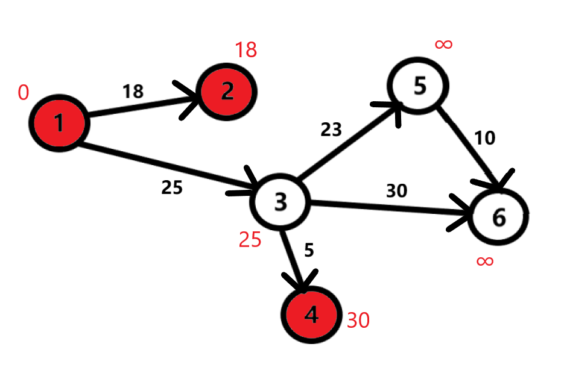
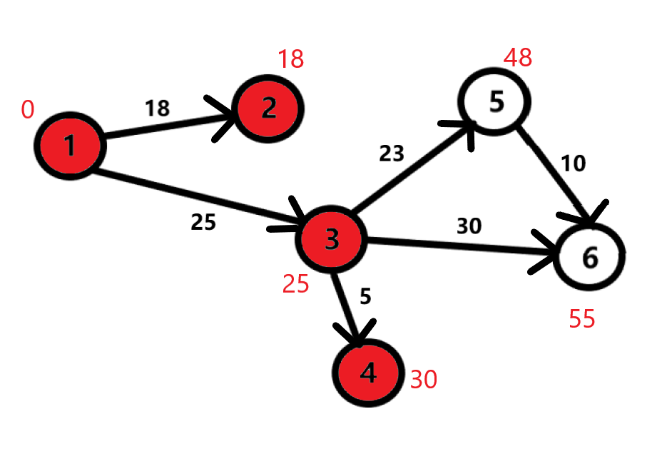
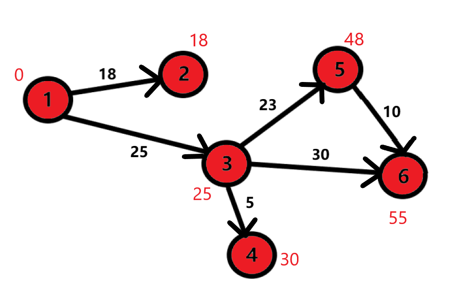

Данный алгоритм был разработан нидерладским ученым Эдгсгером Дейкстрой, из-за чего получил такое название. Алгоритм Дейкстры находит все кратчайшие пути из заданной вершины до всех остальных. С помощью данного алгоритма на практике мы можем узнать, как быстрее добраться из города A в город B по дороге. Это значит, что данный алгоритм имеет достаточно большую распространенность, в том числе и в GPS - навигации.

Однако у этого алгоритма есть существенный минус. Этот минус заключается в том, что алгоритм Дейкстры не умеет работать с ребрами отрицательного веса. Поясним на примере: допустим, что существует такая дорога. И проезд по ней будет убыточным для вашей фирмы. В решении данного вопроса алгоритм Дейкстры нам не поможет. Но, не стоит расстраиваться, ведь существуют другие алгоритмы поиска кратчайшего пути, и в них данный недостаток до настоящего времени не наблюдался (см. Алгоритм Фллойда - Уоршелла).

## Принцип
Рассмотрим следующий орграф:

Присвоим всем вершинам кроме данной расстояние бесконечность, а данной вершине 0 (т.к между одной и той же вершиной расстояние равно 0).

Идем к вершине 2. Смотрим: расстояние предыдущей вершины **1** равно 0, а расстояние до **2** равно 18. Производим несложное сравнение: $$ 0 + 18 \lt \infty $$. Присваиваем расстоянию до **2** 18. Из этой вершины нет путей в другие вершины, поэтому отмечаем **2** как посещенную.

Аналогичные действия проделываем с **3** и **4** * вершинами.

Переходим к вершине **5**. Присваеваем расстоянию до неё $$48$$. Далее рассматриваем вершину **6**. Присваиваем расстоянию $$55$$. Больше нет ребер из вершины **3**, значит отмечаем её как посещенную. Переходим к рассмотрению вершины 5.

Здесь, как можно заметить, мы можем присвоить расстояние до **6** вершины $$58$$. Но у нас уже имеется меньшее число - $$55$$. В таком случае оставляем как есть. Отмечаем вершины **6** и **5** как посещенные. Алшоритм завершает свою работу. Таким образом, мы нашли короткие расстояния из первой вершины до всех остальных.

## Реализация

Для реализации алгоритма Дейкстры нам поторебуется два массива: один, логический, **visited**, для того, чтобы отмечать посещенные вершины; также нам потребуется численный **distance**, для хранения найденных кратчайших путей. Изначально все элементы массива **visited** обозначены как **false**. В каждый элемент массива **distance** мы запишем такое число, которое больше любого потенциально короткого пути. Для удобства будем называть такое число бесконечностью. Однако, это числе не является бесконечностью в прямом смысле этого слова, просто это очень большое число. В данном случае мы будем использовать **INT_MAX**. В качестве вершины, с которой мы начнем обход, будем использовать вершину **a**. Поэтому, **distance[a] = 0** (алгоритм не предусматривает петель).

## Алгоритм

const int v = 6; // число вершин
void Dijkstra(int graph[v][v], int start)
{
	
	int distance[v],index;
	bool visited[v];
	for (int i = 0; i < v; i++)
	{
		distance[i] = INT_MAX;
		visited[i] = false;
	}
	distance[start] = 0;
	for (int i = 0; i < v-1; i++)
	{
		int min = INT_MAX;
		for(int j = 0;j < v;j++)
			if (!visited[j] && distance[j] < min)
			{
				min = distance[j];
				index = j;
			}
		visited[index] = true;
		for(int j = 0; j < v; j++)
		if (!visited[j] && graph[index][j] && distance[index] != INT_MAX &&
			distance[index] + graph[index][j] < distance[j])
			distance[j] = distance[index] + graph[index][j];
	}

	for (int i = 0; i < v; i++) 
		if (distance[i] != INT_MAX)
		cout << start + 1 << " > " << i+1 << " = " << distance[i] << endl;
	   else 
		cout << start + 1 << " > " << i+1 << " = " << "not available" << endl;
}



int main() {
int graph[v][v] = {
		{0, 18, 25, 0, 0, 0},
		{18, 0, 0, 0, 0, 0},
		{25, 0, 0, 5, 23, 30},
		{0, 0, 5, 0, 0, 0},
		{0, 0, 23, 0, 0, 10},
		{0, 0, 30, 0, 10, 0},
	};
	int start;
	cout << "Enter the start vertex: ";
	cin >> start;
	Dijkstra(graph, start-1);
	return 0;
	}
  
Массив **graph** это модифицированная матрица смежности. $$0$$ означает отсутствие вершины, а числа показывают расстояния от вершины $$i$$ до вершины $$j$$.
