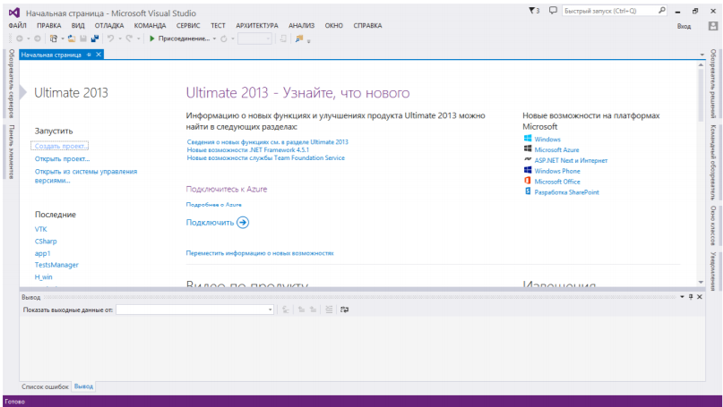

Как уже говорилось в прошлом уроке, чтобы было удобнее писать код нужна среда разработки. По нашему мнению, среда разработки Visual Studio - одна из самых лучших. Ссылку на скачивание вы можете найти в соответствующем разделе. 

Теперь поговорим о запуске программы. Если  студия  запускается  в  первый  раз,  она спросит, на каком языке пишет и какими инструментами пользуется программист. Нам нужно выбрать тот пункт, где есть C++. Если студия уже запускалась, то перед вами появится главное окно. Теперь о том, как создавать программу. Когда мы работали в Pascal.ABC, единственный  файл, с которым мы работали, был файл с расширением pas. В нем была вся наша программа.  Те, кто уже успел поработать с Delphi, видел, что создание программы в Delphi – это работа  над  проектами.  Проекты  содержат  в  себе  файлы  с  расширением  pas  (элементы  нашей  программы) и некоторые другие, предназначенные для Delphi.

В VS всё ещё более серьёзно. Здесь есть такое понятие, как **Решение**. **Решение – это  набор  проектов.**  А  проект  здесь  –  то  же  самое,  что  и  проект  в  Delphi  –  наша  будущая  программа.  Сделано  это  всё  так,  потому  что  VS  –  инструмент  для  профессиональной  разработки  приложений.  А  современные  программные  продукты  создаются  целыми  командами. Более того, все приложения сегодня имеют очень длинный код, который хранить  в 1 файле (даже уже и в 1 проекте) – самоубийство. Поэтому и была создана такая структура  организации программного кода. И, хотя, на первый взгляд кажется, что это сложно, на самом  деле существенно облегчает создание программ.  В  VS  можно  создавать  решение,  а  в  них  сколько‐то  проектов,  а  можно  создать  отдельный проект. Я рекомендую создать решение с именем, например, MyTasks, и включать  туда проекты – т.о. все ваши программы будут в одном месте, вы их не потеряете и будете  иметь удобный доступ к ним.  Чтобы создать новую программу в VS, нужно зайти в меню **Файл - Создать - Проект.**

Появится  вот  такое  окошко.  Чтобы  создать  решение,  установите  галочку  **«Создать  каталог  для  решения»**.  Что  бы  создать  отдельный  проект,  соответственно,  галочку  нужно  снять.  Далее  перейдите  в  левой  части  окошка  к  пункту  **Visual  C++**.  В  средней  части  окна  выберите **«Пустой проект»**. Теперь, если вы создаёте решение, сначала введите в поле **«Имя  решения»** название своего решения, например, MyTasks, затем имя проекта в поле **«Имя»**,  например,  Task1.  Далее  нажмите  кнопку  **«Обзор»**  и  выберите  место,  где  будут  храниться  файлы. Теперь можно нажать кнопку **«ОК»**. В течение некоторого времени студия подготовит  все необходимые файлы и появится следующее окно.

.png)

Должно  появиться  окошко  **«Обозреватель  решений»**,  если  оно  не  появилось,  перейдите в пункт меню **«Вид»** и щёлкните по соответствующему пункту.  Теперь  нам  нужно  добавить  файл  исходного  кода  в  наш  проект.  Щёлкните  правой  кнопкой  по  своему  проекту  в  **Обозревателе  решений**,  выберите  пункт  **добавить**,  а  затем  **Создать элемент**. 

.png)

Появится  окно  создания  файла.  Выберите  **Файл  C++  (.cpp)**,  а  в  поле  имя  введите, 
например, **main.cpp**. Расположение менять  не нужно – по умолчание файл будет сохранён 
там, где у вас хранятся файлы проекта. 

.png)

Нажмите на кнопку **Добавить**. Сразу же откроется редактор текста программы. Теперь  уже можно писать код. вателе  решений,  выберите  пункт  добавить,  а  затем  Создать элемент. 

