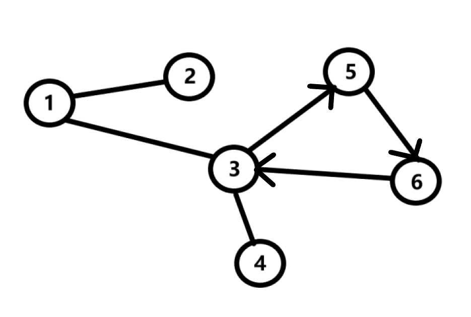
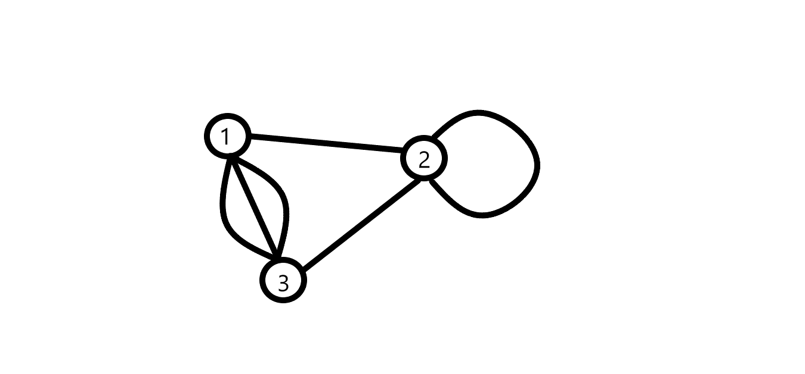

## Введение
Что такое граф? **Граф** - фундаментальное понятие дискретной математики, комбинация набора **вершин** и набора **ребер**. Чтобы лучше понять, что такое граф - представьте дорожную систему некоторой страны N.

Пусть в нашем государстве N 6 городов. Эти города связаны дорогами таким образом, как показано на схеме.

На этой схеме изображен граф. Этот граф имеет 6 вершин и 6 ребер.

Также, дороги в нашей стране могут быть как односторонними, так и двухсторонними. В теории графов приняты следующие термины - графы с односторонними ребрами называют **ориентированными**, иначе - **неориентированными**. До этого наш граф был неориентированным, теперь - ориентированным.

Также мы можем присвоить ребрам графа какой-либо параметр, например, стоимость проезда по дороге. Теперь наш граф стал **взвешенным**.

**Путём** в графе называется последовательность вершин, каждая из которых соединена со следующей вершиной ребром. 
Граф  называют **связным**, если между любой парой вершин существует хотя бы один путь.

## Циклы в графе
Иногда бывает так, что первая вершина, с которой мы начинаем наш путь, совпадает с последней. В этом случае мы можем сказать, что граф имеет цикл.

Так, вершины 3,5,6 связаны циклом.
## Особые графы
Иногда встречаются достаточно специфические графы. В частности, мультиграфы разрешают наличие нескольких ребер между двумя вершинами. Такие ребра называют **кратными**. Также встречаются так называемые **петли**. Петля - ребро, входящее в вершину, из которой она исходит.

## Дерево
Дерево - структура данных, связный граф, не имеющий  циклов. Ребра дерева неориентированы и невзвешены.

**Дерево - это связный граф без циклов, петель и кратных рёбер.**

## Создание графа и методы представления
Существует два способа представления графа. Первый из них - **матрица смежности**. Этот способ достаточно просто реализуется. Пусть у нас есть граф из N вершин, мы создаем матрицу (двумерный массив) $$N * N$$, где будем хранить логические значения. Если путь из вершины i в вершину j существует, то $$graph[i][j] = true$$, в противном случае - $$false$$.

Реализуем следующую программу с использованием матрицы смежности: введем вершины графа и выведем матрицу смежности, где "$$+$$" - означает, что путь существует.


bool graph[100][100] = { false };
int n;// количество ребер
int m;// количество вершин
cout << "enter a number of edges: ";
cin >> n;
cout << "enter a number of vertexes: ";
cin >> m;
for (int i = 1; i <= n; i++)
{
	int u, v;
	сin >> u >> v;
	graph[u][v] = graph[v][u] = true;// граф неориентированный - можем двигаться в обе стороны
  }
cout << "Matrix: " << endl;
for (int i = 0; i < m; i++)
{
	for (int j = 0; j < m; j++)
	{
		if (graph[i][j])
			cout << "+" << " ";
		else
			cout << "." << " ";
	}
	cout << endl;
}
return 0;


У матрицы смежности есть свои преимущества и недостатки. Мы можем проверить, существует ли ребро между двумя вершинами за $$0(1)$$. Очевидно, что матрица занимает $$N^2$$ памяти, что является неприемлемым для больших графов. В такой ситуации мы вынуждены искать оптимальное решение.

Второй способ представления графа - **список смежности**. Его идея заключается в хранении для каждой вершины расширяемого массива (вектора), содержащего всех её соседей.

Теперь для каждой вершины будем выводить количество вершин, смежных с ней.

vector <int> graph[100];
int n, m;
cout << "enter a number of edges: ";
cin >> n;
cout << "enter a number of vertexes: ";
cin >> m;
int c = 0;

for (int i = 0; i < n; i++) {
	int u, v;
	cin >> u >> v;
	u--, v--;// так как нумерация с нуля

	graph[u].push_back(v);
	graph[v].push_back(u);
}

for (int i = 0; i < m; i++) {
	int c = 0;
	for (int v : graph[i]) {    
		c++;                    
	}                           

	cout << c << " edges adjacent to vertex " << i + 1 << endl;
}



Cписок смежности более оптимален по памяти и по времени, чем матрица смежности. Однако, следует учитывать особенности поставленной задачи и выбирать наиболее оптимальный вариант из предложенных.
