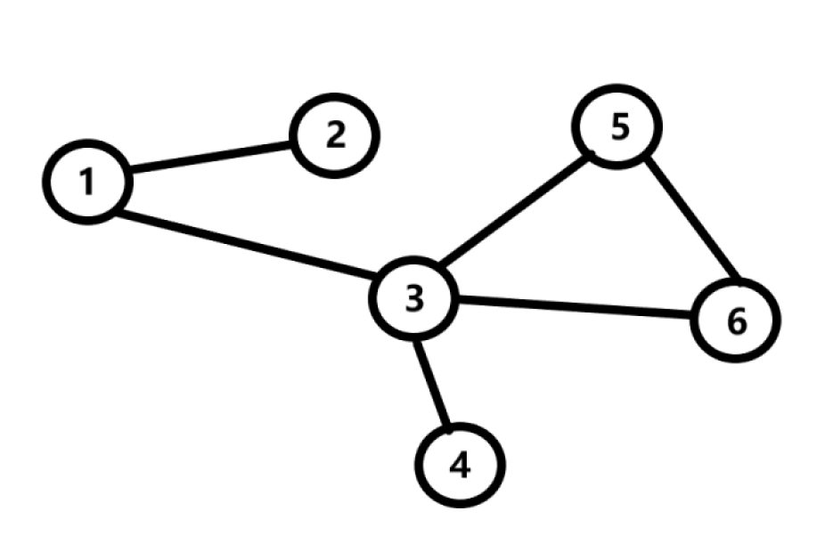
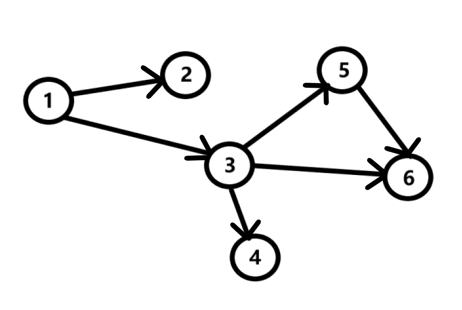
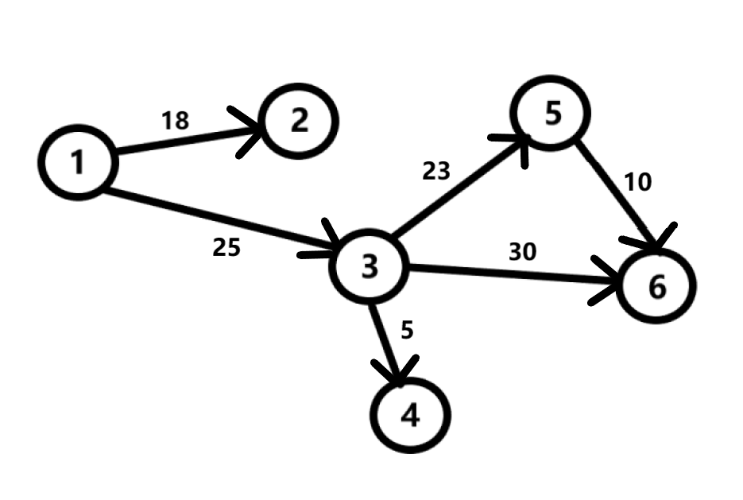
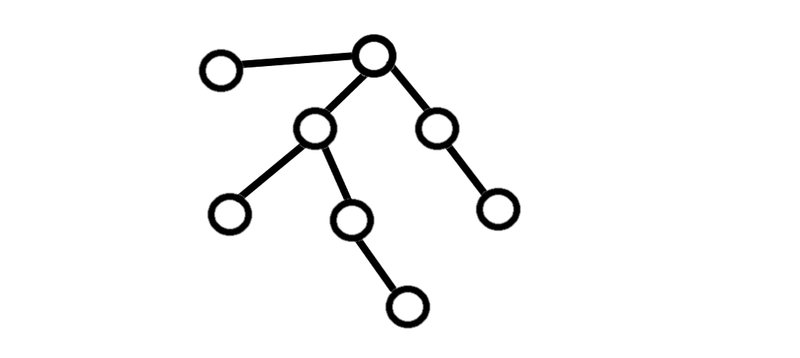

## Введение
Что такое граф? **Граф** - фундаментальное понятие дискретной математики, комбинация набора **вершин** и набора **ребер**. Чтобы лучше понять, что такое граф - представьте дорожную систему некоторой страны N.

Пусть в нашем государстве N 6 городов. Эти города связаны дорогами таким образом, как показано на схеме.

На этой схеме изображен граф. Этот граф имеет 6 вершин и 6 ребер.

Также, дороги в нашей стране могут быть как односторонними, так и двухсторонними. В теории графов приняты следующие термины - графы с односторонними ребрами называют **ориентированными**, иначе - **неориентированными**. До этого наш граф был неориентированным, теперь - ориентированным.

Также мы можем присвоить ребрам графа какой-либо параметр, например, стоимость проезда по дороге. Теперь наш граф стал **взвешенным**.

**Путём** в графе называется последовательность вершин, каждая из которых соединена со следующей ребром. 
Граф  называют **связным**, если между любой парой вершин существует хотя бы один путь.

## Циклы в графе
Иногда бывает так, что первая вершина, с которой мы начинаем наш путь, совпадает с последней. В этом случае мы можем сказать, что граф имеет цикл.

## Особые графы
Иногда встречаются достаточно специфические графы. В частности, мультиграфы разрешают наличие нескольких ребер между двумя вершинами. Такие ребра называют **кратными**. Также встречаются так называемые **петли**. Петля - ребро, входящее в вершину, из которой она исходит.

## Дерево
Дерево - структура данных, связный граф, не имеющий  циклов. Ребра дерева неориентированны и невзвешенны.

**Дерево - это связный граф без циклов, петель и кратных рёбер.**

## Создание графа и методы представления
