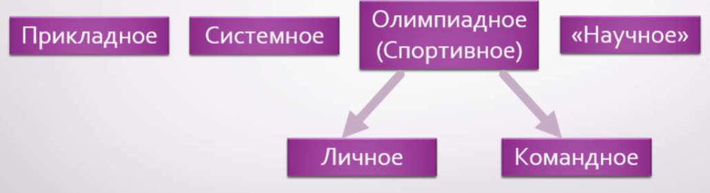

## Для чего был создан данный ресурс?

На просторах интернета вы, безусловно, можете найти информацию, подобную той, что представлена на этом сайте. Однако, изложенный материал может показаться недостаточным, или наоборот, слишком сложным для восприятия.

Данный ресурс был создан для того, чтобы обучающиеся имели доступ к необходимой информации по программированию. Иногда бывает так, что на занятии кто-то что-то не понял, или пропустил занятие, тогда этот ресурс ему поможет. Или если обучающийся всё понял, и хочет идти дальше, тогда данный сайт тоже ему поможет. Вся информация здесь структурирована таким образом, что тема следует из темы логическим образом, и нет нарушения связей. Также, авторы посторались излагать темы четко и понятно, но если у вас остались вопросы, вы можете обратиться на e-mail адрес, расположенный внизу страницы.

## Чем мы будем заниматься?
Чтобы добиться успеха, нужно упорно заниматься. Похорошему, нужно делать это ежедневно. На данном ресурсе представлена теоретическая часть, для практики представлены ссылки в соответствующем разделе. Хочу отметить, что практика в программировании должна занимать 60 процентов всего времени. Практика является важным аспектом обучения, потому что помогает закрепить теоретические сведения. Если не заниматься практикой, в скором времени знания имеют большой шанс исчезнуть. Поэтому практика - важна. Но и без теории никуда.

На данном ресурсе теория представлена в двух разделах. Первый - синтаксис языка C++. Здесь мы узнаем много нового. Если у вас уже был опыт программирования на другом языке (вероятнее всего, на Паскале), то вам будет проще, так как основные принципы вам уже известны. Если у вас по какой - то причине не было опыта программирования - ничего страшного, теория изложена "с нуля". Второй раздел - это алгоритмы и структуры данных. Информация представлена достаточно объемно, но если вам этого мало, то вы можете перейти в раздел "ссылки" и ознакомиться с дополнительными материалами.

## История языка программирования C++
Для того, чтобы хорошо осваивать новые знания, нужно иметь хороший фундамент. Данная статья как раз и ставит целью заложить этот фундамент, дав основные понятия и представления. История развития языка программирования C++ напрямую связана с таким языком, как C. Язык программирования C появился в 1972 году. Этот язык используется и по сей день. Языки программирования, в свою очередь, делят на высокоуровневые и низкоуровневые. **Низкоуровневые** языки - это языки, непосредственно близкие к машинным кодам прцессора. С их помощью можно получить доступ к обурудованию. Примером низкоуровнего языка может быть Ассемблер. 

**Высокоуровневые** языки отличаются высоким уровнем абстракции. Так мы можем узнать длину строки str одной простой командой:

  str.size();


Такие возможности представляет нам высокоуровневое программирование.

## Что такое программа? 
**Программа** - некий набор инструкций для исполнителя (компьютера). Чтобы создать программу, нужен человек. Человека, занимающегося созданием компьютерных программ, называют программистом. Итак, человек - первое звено в цепи создания программ. Далее нужно написать программу. Программа записывается в виде текста на каком-либо языке программирования. Затем программа сохраняется в файле (файлах). Но компьютер не поймет написанный нами текст, так как этот самый текст программы написан на языке, понятным человеку, но не компьютеру. Чтобы компьютер понял, чего от него хотят добиться, уже имеющийся у нас текст на каком-либо языке программирования нужно превратить в набор команд, понятных компьютеру. Этим занимается другая специальная программа - компилятор или интерпретатор. Затем эти инструкции отправляются в компьютер, и компьютер их выполняет.

Для того, чтобы было удобнее писать код, программисты используют среду разработки (IDE - Integreted Development Environment). Такая программа включает в себя: текстовый редактор, компилятор/интерпретатор, отладчик и т.д. Самыми популярными IDE являются Visual Studio, PyCharm, Eclipse.

**Программирование** - процесс создания компьютерных программ.

## Каким бывает программирование?

Как видно из схемы мы можем разделить программирование на несколько подразделов. *Прикладное программирование* включает в себя разработку программ прикладного назначения, например, для бухгалтерской отчетности. *Системное программирование* обеспечивает управление элементами компьютерной системы. Сюда можно отнести разработку утилит, операционных систем и т.д. *Научное программирование* нужно для моделирования процессов окружающей среды, для анализа данных (зачастую больших), расчетов. Например, для языка Python существует библиотека Astropy, позволяющая астрономам решать задачи.

**Что такое олимпиадное программирование?** Олимпиадное программирование - интеллектуальное соревнование по решению задач разной тематики на компьютере. Чтобы решить задачу, нужно её внимательно прочитать. В каждой задаче есть **входные данные** и **выходные данные**. Эти данные нужно тоже внимательно проанализировать. Ваша задача - написать программу, считывающую **входные данные**, обрабатывающую их, и выводящую результат в установленном формате.
Обработка входных данных подразумевает некий алгоритм, подходящий для решения определенной задачи.

Существуют архивы задач по олимпиадному программированию. Их вы можете найти в разделе ссылки.

Например, в задаче [1000 с Timus](http://acm.timus.ru/problem.aspx?space=1&num=1000) нам нужно считать 2 числа, сложить их, и вывести их сумму.

## В чем же заключаются польза от олимпиадного программирования?

1)Изучение алгоритмов на практике

2)Достаточно интересный старт в мир программирования

3)Развитие навыков написания кода, отлавливания ошибок (багов), нахождение оптимального решения по времени/памяти

4)Командное программирование научит вас работе в коллективе

5)Олимпиады по программированию учат быстро, (и что не маловажно!) правильно думать

