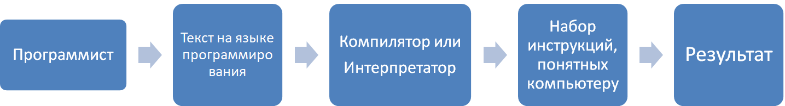

**Что такое программа?** Программа - некий набор инструкций для исполнителя (компьютера). Какими будут инструкции зависит от программиста, они могут быть как сложными, так и простыми. Чтобы создать программу нужен человек. Человека, занимающегося созданием компьютерных программ, называют программистом. Итак, человек - первое звено. Далее нужно написать программу. Программа записывается в виде текста на каком-либо языке программирования. Затем программа сохраняется в файле (файлах). Но компьютер не поймет написанный нами текст. Чтобы компьютер понял, чего от него хотят добиться, уже имеющийся у нас текст на каком-либо языке программирования нужно превратить в набор команд, понятных компьютеру. Этим занимается другая специальная программа - компилятор или интерпретатор. Затем эти инструкции отправляются в компьютер, и компьютер их выполняет.

**Что такое олимпиадное программирование?** Олимпиадное программирование - интеллектуальное соревнование по решению различных задач на компьютере. Чтобы решить задачу, нужно её внимательно прочитать. В каждой задаче есть **входные данные** и **выходные данные**. Эти данные нужно тоже внимательно проанализировать. Ваша задача - написать программу, считывающую **входные данные**, обрабатывающую их, и выводящую результат в установленном формате.
Обработка входных данных подразумевает некий алгоритм, подходящий для решения определенной задачи.

Рассмотрим задачу [1000 с Timus](http://acm.timus.ru/problem.aspx?space=1&num=1000)

Условие: вычислить а+b
Исходные данные: a,b
Результат: a+b
Пример:
Исходные данные | Результат
