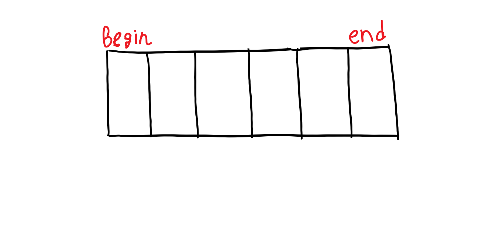

Когда мы говорили о переменных, мы упоминали, что переменная характеризуется тремя вещами: типом данных, значением, и адресом в ячейке памяти. **Указатель** - переменная, которая ссылается на блок памяти. Чтобы узнать адрес переменной, нужно воспользоваться унарной функцией взятия адреса: **&**.

int n = 10;
cout << &n;


Данный код вывел шестнадцатиричное число. Это и есть адрес переменной n в памяти. Для инициализации указателя используют символ $$*$$.

 int variable = 100;
int* ptr; // объявление указателя
ptr = &variable;
cout << *ptr << endl; // разыменование
cout << &variable << endl; // адрес variable
cout << ptr << endl; // значение ptr (= адрес variable)
cout << &ptr << endl; // адрес ptr
 

Запустите программу и сравните вывод.

## Указатели и  массивы
Рассмотрим следующий код:

int arr[] = { 1,2,3,4,5 };
	cout << arr << endl;
	cout << &arr[0];
 

Что можно заметить? Вывод двух данных строчек одинаковый. Значит, что адрес переменной arr совпадает с адресом первого элемента массива arr. Означает ли это, что arr и указатель на arr это один и тот же объект? А как это узнать?

В C++ существует особый метод, позволяющий узнать значение: **typeid(переменная).name()**.

cout << typeid(&arr[0]).name() << endl;
cout << typeid(arr).name() << endl;


Вывод подсказывает нам, что это не один и тот же объект.

## Зачем нужны указатели?
В дальнейшем мы будем использовать указатели, чтобы передавать массивы в функции. Также использование указателей позволяет сократитить используемую память: вместо копирования какого либо объекта мы с помощью указателя можем сослаться на него.

## Итераторы
Такая вещь, как итератор применяется в шаблонах, которые мы будем рассматривать уже очень скоро. Но понять основные концепции итераторов можно уже сейчас.

Вам наверняка знакомо такое понятие как контейнер. В C++ тоже есть своего рода контейнеры. Контейнер в C++ это своего рода сегментированная лента:

**Итератор** - особая сущность, которую используют для обращения к элементам этих самых контейнеров. По умолчанию определины итераторы **begin** и **end**
